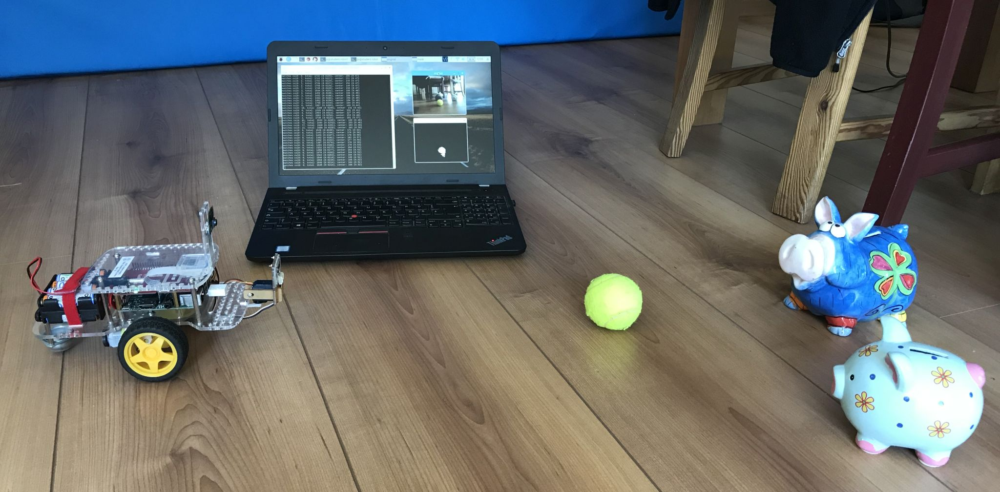
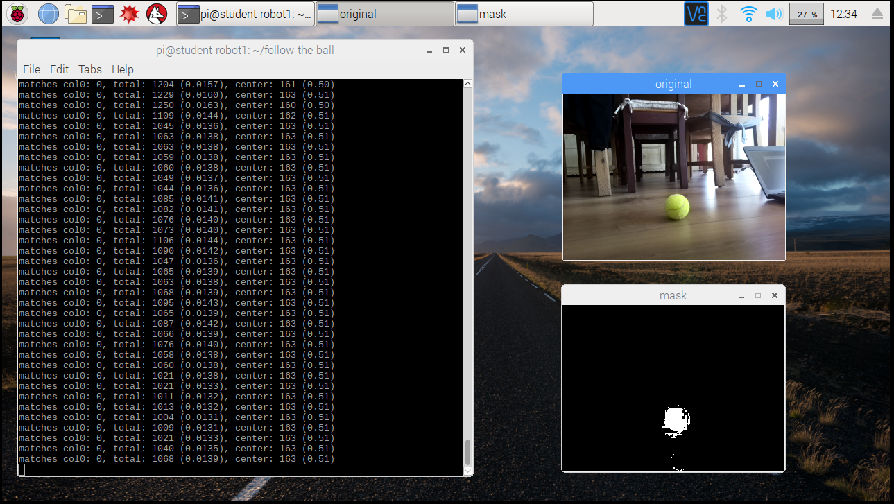

## Voraussetzungen

* Roboter mit der aktuellen Software (siehe [Bau des Roboters](../build_a_robot/) und [Basisinstallation Software](../create_sr_image/)) zuzüglich Installation von OpenCV und Numpy.
* Python Programmierkenntnisse
* Einen weiteren Computer um auf den Roboter zuzugreifen. An diesem Computer sitzt du und programmierst den Roboter. Der Computer kann ein Raspberry Pi mit Monitor, Tastatur und Maus sein, oder ein Windows Laptop. Da der Roboter über WLAN kommuniziert, muss auch der weitere Computer über WLAN kommunizieren können.
* Wie du den Roboter an- und ausschaltest und dich mit dem VNC Viewer und mit ssh verbindest ist in [Mit Roboter verbinden](../create_sr_image/#mit-roboter-verbinden) und [Roboter ausschalten](../create_sr_image/#roboter-ausschalten) erklärt.

## Aufgabe

Ein Objekt, z.B. Tennisball, soll aufgrund seiner Farbe erkannt werden. Der Roboter passt seine Blickrichtung zum Objekt hin an. Er folgt dem Objekt.

## Lösungsidee

Mit der Kamera werden ständig Bilder aufnommen. Mit OpenCV wird nach den Farbwerten des gesuchten Objekts gefiltert. Das Objekt wird dort vermutet, wo es besonders viele Bildpunkte mit passender Farbe gibt. In diese Richtung dreht sich der Roboter.

## Lösungsbeispiel

```python
import time

from pivideocapture import PiVideoCapture

import cv2
import numpy as np

from easygopigo3 import EasyGoPiGo3

with PiVideoCapture(resolution=(320,240), framerate=10) as vc:
    
    print("camera resolution: {}".format(vc.camera_resolution()))
    print("camera framerate : {}".format(vc.camera_framerate()))

    egpg3 = EasyGoPiGo3()
    try:
        # move distance sensor straight (just to look nice)
        egpg3.init_servo(port = "SERVO1").reset_servo()

        print("Press Ctrl-C to stop")
        try:
            while True:
                original = vc.read()
                hsv = cv2.cvtColor(original, cv2.COLOR_BGR2HSV)
                #print("hsv: {0[0]} {0[1]} {0[2]}".format(hsv[0,0]))
                mask = cv2.inRange(hsv, np.array([20,100,70]), np.array([40,255,255]))
                
                cv2.imshow('original', original)
                #cv2.imshow('hsv', hsv)
                cv2.imshow('mask', mask)

                cv2.waitKey(1)

                # each mask element contains the values 0 or 255
                # sum up matching pixels per column
                match_distribution = mask.sum(axis=0) // 255
                total_matches = match_distribution.sum()
                matches = total_matches / mask.size

                if matches > 0.002:
                    sum = 0
                    for i in range(match_distribution.size):
                        sum += i * match_distribution[i]

                    average = sum // total_matches
                    match_center = average / match_distribution.size

                    print("matches col0: {}, total: {} ({:.4f}), center: {} ({:.2f})". \
                        format(match_distribution[0], total_matches, matches, average, match_center))

                    if match_center < 0.45:
                        egpg3.set_speed(egpg3.DEFAULT_SPEED * ((0.5 - match_center) * 1.5))
                        egpg3.spin_left()
                    elif match_center < 0.55:
                        egpg3.stop()
                    else:
                        egpg3.set_speed(egpg3.DEFAULT_SPEED * ((match_center - 0.5) * 1.5))
                        egpg3.spin_right()

                else:
                    print("matches col0: {}, total: {} ({:.4f})". \
                        format(match_distribution[0], total_matches, matches))
                    egpg3.stop()

        except KeyboardInterrupt:
            pass

    finally:
        egpg3.reset_all()

    print("elasped time: {:.2f} secs".format(vc.elapsed_time()))
    print("capture rate: {:.2f} fps".format(vc.capture_framerate()))
    print("drop rate   : {:.2f} fps".format(vc.drop_framerate()))
```

Rechts oben das Originalbild von der Kamera. Das untere Bild zeigt Stellen mit grünlichen Farben weiss an. Dort wird der Ball vermutet.



Filtern der Kamerabilder nach grünlichen Farben:

[](https://youtu.be/Yp2DmdV0uzA)

Der Roboter bewegt sich in die Richtung mit den meisten passenden Farben:

[](https://youtu.be/Bk6Mf2Azcjs)

*Copyright 2018 Marko Kimpel*

*Licensed under the GNU General Public License version 3, or (at your option) any later version.*
