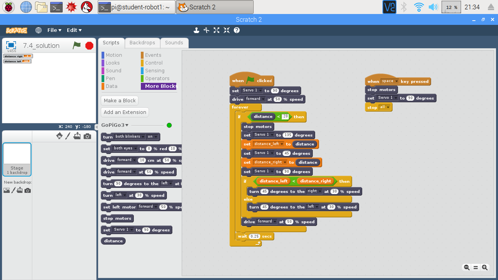
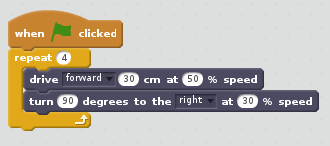
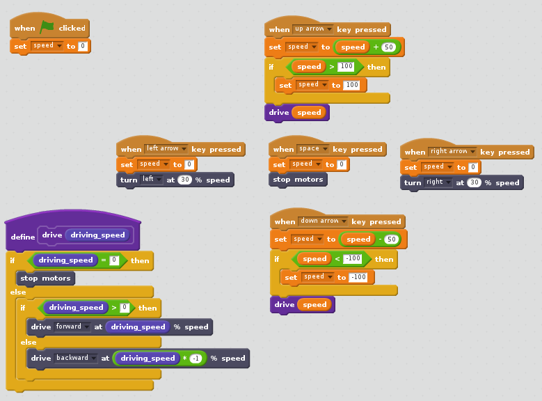
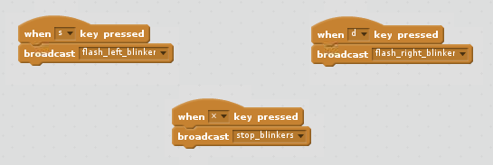
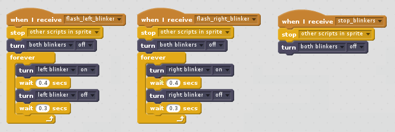
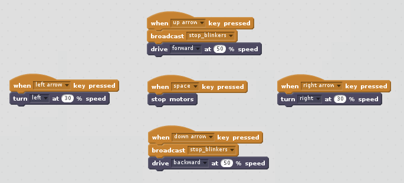
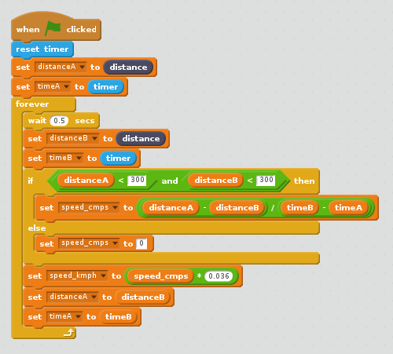
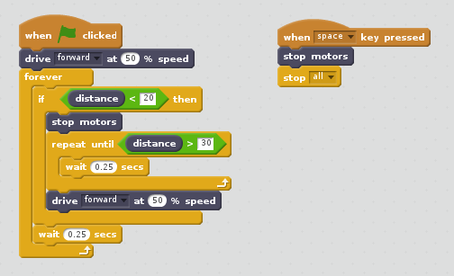
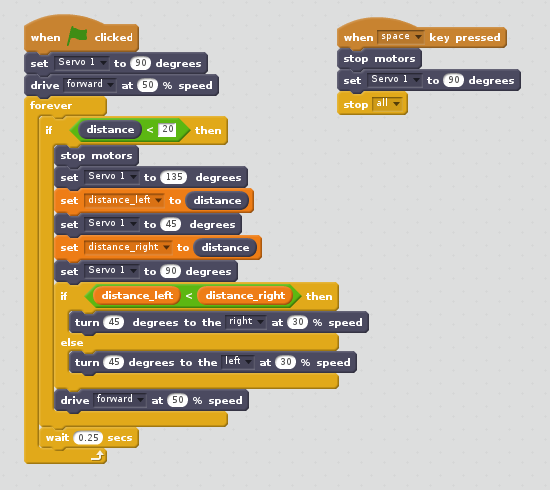

Scratch 2 Offline Editor

## Voraussetzungen

* Roboter mit der aktuellen Software (siehe [Bau des Roboters](../build_a_robot/) und [Basisinstallation Software](../create_sr_image/))
* Einen weiteren Computer um auf den Roboter zuzugreifen. An diesem Computer sitzt du und programmierst den Roboter. Der Computer kann ein Raspberry Pi mit Monitor, Tastatur und Maus sein, oder ein Windows Laptop. Da der Roboter über WLAN kommuniziert, muss auch der weitere Computer über WLAN kommunizieren können.
* Wie du den Roboter an- und ausschaltest und dich mit dem VNC Viewer verbindest ist in [Basisinstallation Software](../create_sr_image/) Kapiteln *Mit Roboter verbinden* und *Roboter ausschalten* erklärt.

## GoPiGo3 Server starten

* Scratch benötigt eine Erweiterung um den Roboter steuern zu können. Teil der Erweiterung ist der GoPiGo3 Server. Dieser muss zuerst gestartet werden.
* Terminal öffnen und ausführen

```
pi@student-robot:~ $ cd gopigoscratchextension/
pi@student-robot:~/gopigoscratchextension $ cd gpg3server/
pi@student-robot:~/gopigoscratchextension/gpg3server $ ./run.sh 
Server listening at 0.0.0.0:8080

GPG3 Server homepage : http://127.0.0.1:8080/
Scratch extension URL: http://127.0.0.1:8080/scratch_extension.js

Press Ctrl-C to stop server
```

* Sollte beim Starten des Serves eine Fehlermeldung über zu alte Firmware erscheinen (z.B. *gopigo3.FirmwareVersionError: GoPiGo3 firmware needs to be version 1.0.x but is currently version 0.3.4*), dann muss die GoPiGo3 Firmware einmalig aktualisiert werden:

```
pi@student-robot:~ $ cd ~/Dexter/GoPiGo3/
pi@student-robot:~/Dexter/GoPiGo3 $ sudo bash Firmware/gopigo3_flash_firmware.sh
```

* Bitte die angezeigten URLs für *GPG3 Server homepage* und *Scratch extension URL* beachten. Diese werden später gebraucht.
* Bitte das Terminal offen lassen, während man mit Scratch arbeitet. Das Schliessen des Terminals würde den Server stoppen.

## Roboterfunktionen kennen lernen

* Im Browser die GPG3 Server homepage (im Beispiel *http://127.0.0.1:8080/*) öffnen.
* Zu *Controller UI* gehen.

## Scratch starten

* Scratch ist Teil der Rasbian Distribution und damit Teil des Schüler-Roboter Images.
* Menüpunkt *Programming*, *Scratch 2* starten
* Die Sprache kann bei Bedarf geändert werden. Hierzu den Erdball links oben anklicken und die gewünschte Sprache wählen. Viele Texte, aber nicht alle, erscheinen dann in der gewählten Sprache.
* Das Laden von Erweiterungen funktioniert in Scratch 2 so:
  * Umschalttaste (Shift-Taste) gedrückt halten und Menü *Datei* anklicken.
  * Durch das Drücken der Umschalttaste werden weitere Menüpunkte angezeigt. Wir wählen *Import experimental extension*.
  * Die *Scratch extension URL* (im Beispiel *http://127.0.0.1:8080/scratch_extension.js*) eingeben.
  * Im Bereich *Skripte* werden in der Gruppe *Weitere Blöcke* Funktionen angeboten, die du zum Steuern des Roboters benutzen kannst.
  
## Projekte laden und speichern in Scratch

* Das Laden und Speichern von Projekten mit Erweiterungen ist etwas hakelig in Scratch 2. Wird in einem Projekt eine Erweiterung verwendet, so verwendet Scratch beim Speichern des Projekts immer den Dateiendung *.sbx* (auch wenn man eine andere angibt). Beim Laden besteht Scratch jedoch auf die Dateiendung *.sb2*.
* Ein Workaround ist, die Projekte mit *.sbx* Dateinamen zu speichern und einen Link vom *.sb2* Dateinamen auf den *.sbx* Dateinamen zu erstellen. Damit steht der Inhalt der Datei unter zwei verschiedenen Dateinamen zur Verfügung. Bei Laden des Projektes wählt man dann einfach den *.sb2* Dateinamen und läd somit den Inhalt der *.sbx* Datei.
* Im Terminal:

```
pi@student-robot:~/Scratch $ ls -l
total 60
-rw------- 1 pi pi 58064 Apr 15 13:53 Project.sbx
pi@student-robot:~/Scratch $ ln -s Project.sbx Project.sb2
pi@student-robot:~/Scratch $ ls -l
total 60
lrwxrwxrwx 1 pi pi    11 Apr 15 13:58 Project.sb2 -> Project.sbx
-rw------- 1 pi pi 58064 Apr 15 13:53 Project.sbx
pi@student-robot:~/Scratch $ 
```

* Nach dem Laden des Projektes erscheinen Blöcke aus der Erweiterung rot. Lade nun die Erweiterung wie oben beschrieben. Die Blöcke erscheinen dann grau und können benutzt werden.

## Übung 1: Blinken

### Programmiertechniken

* Sequenz
* Schleife

### Aufgabe 1.1

* Blinke 2x mit beiden Blinkern
* Blinken: Blinker LED an für eine Zeitspanne, dann Blinker LED aus für eine Zeitspanne.
* Finde einen geeigneten Block in der Gruppe *Weitere Blöcke* zur Steuerung.
* Nutze den *warte* Block aus der Gruppe *Steuerung*. Tipp: Nutze die englische Notation (Punkt statt Komma) bei der Eingabe eines Bruchteils einer Sekunde (z.B. *0.5*).
* Finde eine geeignete Zeitdauer für das Blinken.

*Beispiellösung*


[1.1_solution.sbx](scratch/1.1_solution.sbx)

### Aufgabe 1.2

* Blinke 10x mit beiden Blinkern
* Suche einen gegeigneten Block in der Gruppe *Steuerung* um ein *schönes* Programm zu schreiben.
* Warum ist das Programm mit einer Schleife *schöner*?

*Beispiellösung* 


[1.2_solution.sbx](scratch/1.2_solution.sbx)

## Übung 2: Musterfahrt

### Programmiertechniken

* Sequenz
* Schleife

### Aufgabe 2.1

* Lass deinen Roboter folgendes Muster fahren.

```
+------+
|      |
|      |
|      |
^------+
```

* Kantenlänge ist jeweils 30 cm.
* Am Ende soll der Roboter auf der Ausgangsposition stehen und in die gleiche Richtung schauen.
* Kann das Programm mit einer Schleife vereinfacht werden?

*Beispiellösung*



[2.1_solution.sbx](scratch/2.1_solution.sbx)

### Aufgabe 2.2

* Lass deinen Roboter folgendes Muster fahren.

```
^----+
     |
     |
+----+
|
|
+----+
     |
     |
+----+
|
|
^
```

* Kantenlänge ist jeweils 30 cm.
* Kann das Programm mit einer Schleife vereinfacht werden?

*Beispiellösung*


[2.2_solution.sbx](scratch/2.2_solution.sbx)

## Übung 3: Warnlichter beim Fahren

### Programmiertechniken

* Sequenz
* Schleife
* Parallelisierung

### Aufgabe 3.1

* Viele große Fahrzeuge nutzen Warntöne oder Warnlichter um ihrer Umgebung anzuzeigen, dass sie sich bewegen.
* Nutze die Augen des Roboters als Warnlicht. Es soll regelmäßig kurz rot aufblitzen.
* Die Warnlichter sollen beginnen zu blitzen, wenn das Programm startet (Nutzer klickt grünes Fähnchen) und aufhören, wenn es endet (Nutzer klickt rotes Stopp-Symbol).
* Der Roboter bewegt sich in dieser Aufgabe noch nicht.

*Beispiellösung*


[3.1_solution.sbx](scratch/3.1_solution.sbx)

### Aufgabe 3.2

* Füge dem Projekt ein weiteres Script - mit eigenem *wenn grüne Fahne angeklickt* Startblock - hinzu. Das Script soll die aus Aufgabe 2.1 bekannte Aufgabenstellung - ein Quadrat abfahren - lösen.
* Führe das Projekt aus. Was stellst du fest?

*Beispiellösung*


[3.2_solution.sbx](scratch/3.2_solution.sbx)

Beobachtung:
* Scripte zum Fahren und Blitzen werden gleichzeitig ausgeführt.
* Wenn das Script zum Fahren endet, läuft das Script zum Blitzen weiter - bis das Programm gestoppt wird.
* Das Blitzscript müsste automatisch gestoppt werden, wenn das Fahrscript endet.

### Aufgabe 3.3

* In der Gruppe *Steuerung* gibt es einen Block zum Stoppen von Scripten.
* Nutze diesen Block so, dass am Ende der Fahrtstrecke das Warnlicht abgeschaltet wird.

*Beispiellösung*


[3.3_solution.sbx](scratch/3.3_solution.sbx)

## Übung 4: Manuelle Robotersteuerung

### Programmiertechniken

* Ereignisorientierung
* Verzweigung
* Variablen
* Unterprogramme

### Aufgabe 4.1

* Der Roboter soll über die Richtungstasten (Pfeil nach oben, unten, links, rechts) gesteuert werden. Die Leertaste soll den Roboter anhalten. Wird eine Richtungstaste gedrückt, bewegt sich der Roboter solange in diese Richtung, bis eine andere Richtung, oder Stopp gewählt wird.
* Nutze den *Wenn Taste gedrückt* Block aus der Gruppe *Ereignisse*.
* Der Roboter soll sich langsam bewegen: vorwärts/rückwärts bei 50% Geschwindigkeit, links/rechts bei 30% Geschwindigkeit.
* Tipp: Implementiere zuerst die Stopp-Taste. :-)

*Beispiellösung*


[4.1_solution.sbx](scratch/4.1_solution.sbx)

### Aufgabe 4.2

* Erlaube dem Roboter mit unterschiedlichen Geschwindigkeiten vorwärts und rückwärts zu fahren.
* Zur Steuerung werden die Tasten Pfeil nach oben und Pfeil nach unten benutzt. Beim Drücken der Pfeil nach oben Taste wird die Geschwindigkeit beim Vorwärtsfahren erhöht bzw. die Geschwindigkeit beim Rückwärtsfahren reduziert. Beispiele: Roboter steht, 1x Pfeil nach oben -> 50% vorwärts, nochmaliges Drücken -> 100% vorwärts. Die Pfeil nach unten Taste reduziert die Geschwindigkeit beim Vorwärtsfahren und erhöht die Geschwindigkeit beim Rückwärtsfahren. Beispiele: Roboter fährt mit 100% vorwärts, 1x Pfeil nach unten -> 50% vorwärts, nochmaliges Drücken -> Stopp, nochmaliges Drücken -> 50% rückwärts, nochmaliges Drücken -> 100% rückwärts.
* Benutze eine Variable um dir die gewählte Vorwärts/Rückwärts-Geschwindigkeit zu merken. Variablen findest du in der Gruppe *Daten* in Scratch.

*Beispiellösung*


[4.2_solution.sbx](scratch/4.2_solution.sbx)

### Aufgabe 4.3

* Enthalten mehrere Scripte den gleichen Programmcode, kann es sinnvoll sein, diesen in einen weiteren Block zu verschieben und von verschiedenen Stellen her aufzurufen.
* Definiere einen neuen Block in der Gruppe *Weitere Blöcke*. Dieser Block die zum Vorwärts-/Rückwärtsfahren notwendigen Schritte enthalten.

*Beispiellösung*



[4.3_solution.sbx](scratch/4.3_solution.sbx)

## Übung 5: Blinken beim Abbiegen

### Programmiertechniken

* Ereignisorientierung
* Nachrichten
* Klassen
* Parallelisierung

### Aufgabe 5.1

* Die manuelle Robotersteuerung aus Übung 4 soll um die Funktion des Blinkens erweitert werden. Als Blinker werden die roten LEDs an der Vorderseite des GoPiGo3 genutzt.
* Über die Tasten *S* und *D* soll der linke bzw. rechte Blinker aktiviert werden. Nach der Aktivierung blinkt er regelmäßig, bis ein anderer Blinker oder die Taste *X* gedrückt wird. Taste X schaltet die Blinker ab.
* Die Blinkfunktion soll über eine weitere Figur realisiert werden, die auf die Nachrichten *flash_left_blinker*, *flash_right_blinker* und *stop_blinkers* reagiert. Diese Nachrichten werden jeweils bei Druck der Tasten S, D und X gesendet.

*Beispiellösung*



Neue Figure *Blinker*:



[5.1_solution.sbx](scratch/5.1_solution.sbx)

- Beim Drücken der Tasten S oder D wird eine Nachricht gesendet und nicht auf deren Verarbeitungsende gewartet (asynchrone Verarbeitung). Damit wird ein neuer Ausführungspfad (Thread) für den Empfänger der Nachricht gestartet.
- Der Ausführungspfad ist realisiert als Endlosschleife, die den jeweiligen Blinker regelmäßig an und aus schaltet. Die Endlosschleife wird durch den Block *Stoppe andere Skripte der Figur* durch ein anders Skript der Figur.

### Aufgabe 5.2

* Die Blinker sollen nicht nur manuell ausgeschaltet werden können, sondern gehen automatisch aus, wenn nach der Kurvenfahrt wieder in die Geradeausfahrt gewechselt wird.

*Beispiellösung*



[5.2_solution.sbx](scratch/5.2_solution.sbx)

## Übung 6: Geschwindigkeitsmessung

### Programmiertechniken

* Schleife
* Verzweigung
* Variablen

### Aufgabe 6.1

* Der Roboter hat einen Abstandssensor. Nutze ihn um die Geschwindigkeit eines ihm entgegenkommenden Objekts zu ermitteln.
* Die Geschwindigkeit soll in cm/s und km/h angezeigt werden.
* Idee: Es werden zwei Abstandsmessungen durchgeführt. Zu jeder Messung wird die Zeit mit Hilfe der *Stoppuhr* ermittelt. Aus dem Abstandsunterschied und der dafür benötigten Zeitdauer wird die Geschwindigkeit errechnet.

*Beispiellösung*



[6.1_solution.sbx](scratch/6.1_solution.sbx)

## Übung 7: Hindernisvermeidung

### Programmiertechniken

* Schleife
* Verzweigung
* Variablen

### Aufgabe 7.1

* In dieser Übung soll der Roboter lernen, sich selbständig in seiner Umgebung zu bewegen - ohne anzustossen. Wir beginnen einfach und erweitern das Programm schrittweise.
* Nach Programmstart soll der Roboter geradeaus fahren, bis er in ca. 20 cm Entfernung ein Hindernis erkennt. Da soll er stehen bleiben und das Programm endet.
* Tipp: Schreibe auch ein Skript um den Roboter im Notfall mit einem Tastendruck stoppen zu können - eine Art *Notaus*.

*Beispiellösung*


[7.1_solution.sbx](scratch/7.1_solution.sbx)

### Aufgabe 7.2

* Der Roboter soll vor Hindernissen so lange stehen bleiben, bis diese sich wegbewegen (z.B. ein Mensch). Ist das Hindernis mindestens 30 cm vom Roboter entfernt, setzt er seine Fahrt fort. Bis er wieder auf ein Hindernis trifft...

*Beispiellösung*



[7.2_solution.sbx](scratch/7.2_solution.sbx)

### Aufgabe 7.3

* Statt vor dem Hindernis stehen zu bleiben und zu warten, soll sich der Roboter langsam auf der Stelle drehen und damit eine freie Bahn suchen. Ist mehr als 30 cm Platz setzt er seine Fahrt fort. Er ist dem Hindernis ausgewichen.

*Beispiellösung*


[7.3_solution.sbx](scratch/7.3_solution.sbx)

### Aufgabe 7.4

* Stösst der Roboter auf ein Hindernis, soll er den Servo Motor nutzen, um den Freiraum rechts und links von ihm zu ermitteln. In die Richtung, wo der meiste Platz ist, soll er seine Fahrt fortsetzen. 

*Beispiellösung*



[7.4_solution.sbx](scratch/7.4_solution.sbx)

## Genutzte Programmiertechniken

* Sequenz
* Verzweigung
* Schleife
* Ereignisorientierung
* Parallelisierung
* Nachrichten
* Variablen 
* Unterprogramme
* Klassen

## Ideen für Erweiterungen

* Übung X: Ladar Screen
* Übung X: IFR Approach
* Übung X: Kamera
* Übung X: Durch Labyrinth fahren
* Script zum erstellen von .sb2 links für .sbx Dateien

*Copyright 2018 Marko Kimpel*

*Licensed under the GNU General Public License version 3, or (at your option) any later version.*
